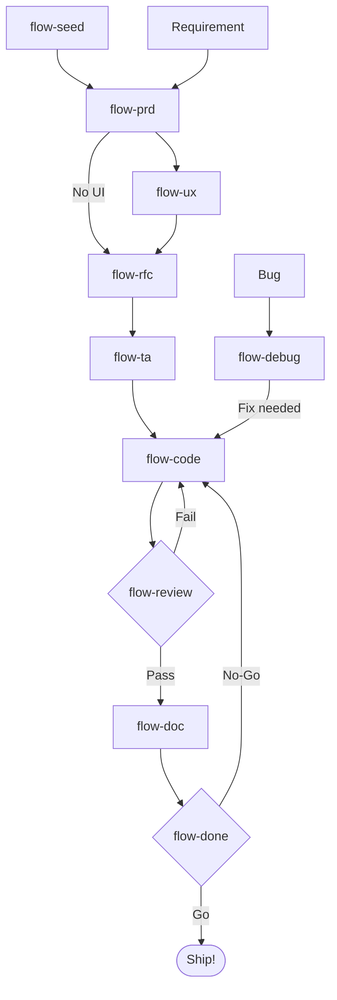
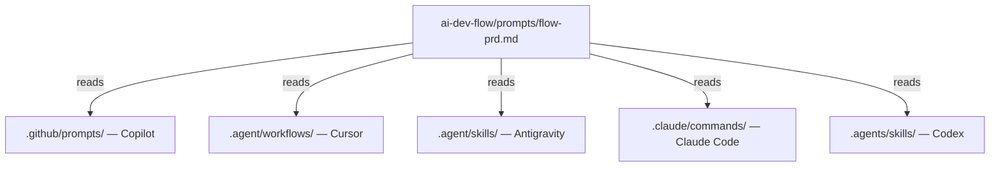
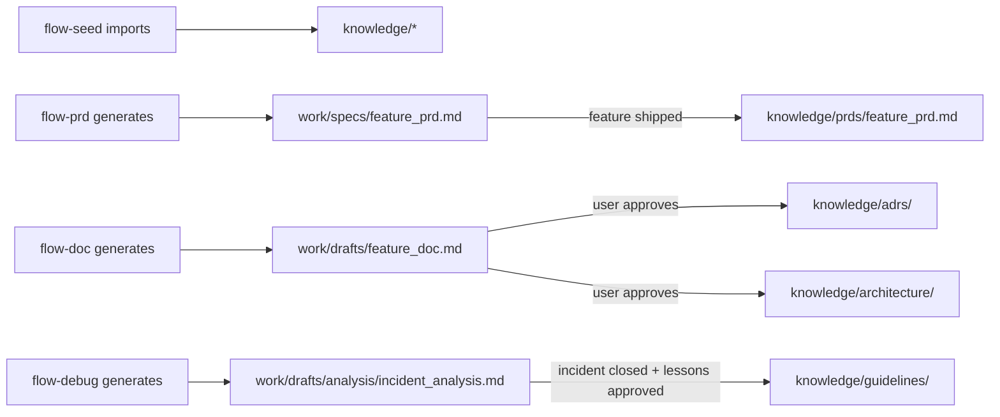

<div align="center">

# AI Dev Flow

### A structured methodology for AI-assisted software development

**Stop prompting randomly. Start engineering with AI.**

[](LICENSE)
[](CONTRIBUTING.md)
[](https://github.com/features/copilot)
[](https://cursor.sh)
[](https://claude.ai)
[](https://openai.com/codex)
[](https://antigravity.google)

[Getting Started](#getting-started) · [The Flow](#the-flow) · [How It Works](#how-it-works) · [Playbook](ai-dev-flow/PLAYBOOK.md) · [Portugu&ecirc;s](README.pt-br.md)

</div>

---

## The Problem

AI coding assistants are powerful, but without structure they produce inconsistent, untraceable, and unreviewable output. Teams end up with:

- PRDs that lack clarity and acceptance criteria
- Architecture decisions made in chat and lost forever
- Code that works but doesn't follow project standards
- Reviews that miss security vulnerabilities and ADR violations
- Documentation that's outdated the day it's written
- No clear definition of "done"

**AI Dev Flow solves this** by giving your AI assistant a complete methodology, from product requirements to production readiness.

---

## What Is AI Dev Flow?

AI Dev Flow is a **methodology kit** that plugs into your existing project. It provides:

- **10 slash commands** that guide AI through a structured SDLC (9-step feature lifecycle plus onboarding and parallel debug)
- **Shared prompts** that work across GitHub Copilot, Cursor, Claude Code, OpenAI Codex, and Antigravity
- **A knowledge base** structure where your AI reads project guidelines, ADRs, and architecture docs
- **Work artifacts** that create a traceable paper trail from PRD to production
- **Engineering best practices** baked into every step (SOLID, Clean Architecture, DDD, OWASP, TDD)

It's not a framework, not a CLI tool, not a SaaS. It's a set of files you copy into your project. Zero dependencies. Zero lock-in.

---

## The Flow

```
/flow-seed     Prime knowledge/           Import existing docs into knowledge/ (onboarding, recommended before first PRD)
/flow-prd      Define what to build       Product Requirements + Definition of Done
/flow-ux       Design the experience      UX/UI Design Specification (Atomic Design, Design Tokens, Motion, WCAG 2.2)
/flow-rfc      Choose how to build it     Alternatives, Decision Matrix, Recommendation
/flow-ta       Design the details         Engineering Assessment, BDD, Implementation Plan
/flow-code     Build it                   TDD, Full-cycle: migrations, config, observability
/flow-review   Validate it               11-dimension review, OWASP 2025, DoD check
/flow-doc      Document it               ADRs, C4 Architecture, Living Documentation
/flow-done     Ship it                   Production Readiness, Retrospective, Go/No-Go
/flow-debug    Fix it                    Parallel, anytime, systematic investigation
```



---

## Getting Started

### Installation

```bash
# Clone the repo
git clone https://github.com/viniciuscarneiro/ai-dev-flow.git /tmp/ai-dev-flow

# Install into your project (never overwrites existing files)
/tmp/ai-dev-flow/setup.sh /path/to/your/project

# Or one-liner
git clone https://github.com/viniciuscarneiro/ai-dev-flow.git /tmp/ai-dev-flow && /tmp/ai-dev-flow/setup.sh .
```

The setup script copies **71 files** into your project:
- 10 prompts (the methodology)
- 50 AI assistant wrappers (Copilot + Cursor + Claude Code + Codex + Antigravity)
- 5 knowledge templates (guidelines, ADRs, architecture, PRDs, assessments)
- Engineering principles and design principles references
- Playbook (operating manual)
- Work directories for artifacts

**It never overwrites.** Run it again safely, it only creates what's missing.

### Seed Your Knowledge Base (Recommended)

The AI produces better output when it knows your project. Run **`/flow-seed`** with your assistant to import existing Markdown safely (same spirit as setup: no overwrite by default), or copy manually:

```
ai-dev-flow/knowledge/
├── guidelines/     Your coding standards, naming conventions, patterns
├── adrs/           Your architectural decisions
├── architecture/   Your system diagrams and overview
├── prds/           Your completed PRDs
└── assessments/    Your completed tech assessments
```

Each folder has a `_template.md` showing the expected format.

### Start Using It

Open your AI coding assistant and type:

```
/flow-prd I need a feature that allows users to filter orders by status
```

The AI will:
1. Read your project's knowledge base
2. Analyze the requirement critically
3. Ask clarifying questions
4. Generate a structured PRD with Definition of Done
5. If `knowledge/` is still thin, suggest `/flow-seed` or manual docs before deep work
6. Suggest the next step (`/flow-ux` for UI work, `/flow-rfc` when there is no UI)

---

## How It Works

### Architecture

```
your-project/
├── ai-dev-flow/                    Everything lives here
│   ├── PLAYBOOK.md                 Operating manual
│   ├── prompts/                    Source of truth (10 prompts)
│   ├── knowledge/                  Your project's brain
│   │   ├── guidelines/             Standards the AI follows
│   │   ├── adrs/                   Decisions the AI respects
│   │   ├── architecture/           System context the AI reads
│   │   ├── prds/                   Completed PRDs for reference
│   │   └── assessments/            Completed TAs for reference
│   └── work/                       AI-generated artifacts
│       ├── specs/                  Active PRDs, RFCs, TAs
│       └── drafts/                 Documentation drafts, debug reports
│           └── analysis/           Debug analysis reports
│
├── .github/prompts/                GitHub Copilot wrappers
├── .agent/workflows/               Cursor wrappers
├── .agent/skills/                  Antigravity wrappers
├── .claude/commands/               Claude Code wrappers
└── .agents/skills/                 OpenAI Codex wrappers
```

### One Prompt, Five Assistants

Edit once in `ai-dev-flow/prompts/`, all assistants stay in sync:



### Knowledge Flow

Artifacts have a lifecycle, from volatile work to permanent knowledge:



---

## What's Inside Each Step

| Step | Role | Inspired By | Key Output |
|------|------|-------------|------------|
| **Seed** | Librarian / Tech writer | Docs as Code, safe import | Files under `knowledge/` from existing docs |
| **PRD** | Senior Product Manager | Amazon Working Backwards, MoSCoW | Requirements, User Stories, DoD |
| **UX** | Senior UX/UI Designer | Atomic Design, Design Tokens, WCAG 2.2 | Design Spec, Component Map, Motion, Accessibility |
| **RFC** | Staff Engineer | Google Design Docs, Uber RFCs | Decision Matrix, System Design, Recommendation |
| **TA** | Principal Engineer | 28-category engineering checklist | BDD Scenarios, Implementation Sequence |
| **Code** | Senior Full-Cycle Engineer | TDD (Kent Beck), Clean Code, SMURF (Google) | Code, Tests, Migrations, Config |
| **Review** | Staff Code Reviewer | Google/Microsoft Review Guidelines, OWASP 2025 | Findings with severity, DoD validation |
| **Doc** | Software Architect | Living Documentation (Martraire), C4 (Brown), ADR (Nygard) | ADRs, Architecture Docs, BDD from code |
| **Done** | Release Coordinator | Google PRR, Amazon ORR, Microsoft Ship/No-Ship | Completion Report, Retro, Go/No-Go |
| **Debug** | Senior SRE | Agans' 9 Rules, Google SRE, Fishbone | Analysis Report, Post-Mortem |

---

## Built-In Best Practices

Every prompt is grounded in proven engineering practices:

- **Product**: Amazon Working Backwards, MoSCoW prioritization, User and Job Stories
- **UX/UI**: Atomic Design (Frost), Design Tokens, Motion Design, WCAG 2.2 AA
- **Architecture**: Clean Architecture, Hexagonal, DDD, SOLID, KISS, YAGNI
- **Security**: OWASP Top 10:2025 (updated with Supply Chain at #3, Exceptional Conditions at #10)
- **Code Quality**: Clean Code (Martin), Design Patterns (GoF), Code Smells, KISS, YAGNI
- **Testing**: TDD (Beck Canon 2023), SMURF Framework (Google 2024), Test Pyramid
- **Review**: Google Code Review Guidelines, Microsoft Engineering Fundamentals
- **Documentation**: Living Documentation (Martraire), C4 Model (Brown), ADR (Nygard)
- **Incidents**: Agans' 9 Rules, Google SRE, Amazon COE, Blameless Post-Mortems
- **Completion**: Google PRR, Amazon ORR, Microsoft Ship/No-Ship, Wix Feature Retros

---

## Supported AI Coding Assistants

| Assistant | IDE / Environment | Slash Commands | How It Works |
|-----------|-----------------|---------------|-------------|
| **GitHub Copilot** | VS Code, JetBrains, Visual Studio, Xcode, Eclipse | `/flow-prd`, `/flow-rfc`, ... | Reads from `.github/prompts/` |
| **Cursor** | Cursor, JetBrains (via ACP) | `/flow-prd`, `/flow-rfc`, ... | Reads from `.agent/workflows/` |
| **Google Antigravity** | Antigravity | `flow-prd`, `flow-rfc`, ... | Reads from `.agent/skills/` |
| **Claude Code** | VS Code, JetBrains, Windsurf, Zed, Neovim, Emacs, Claude Desktop, Terminal | `/flow-prd`, `/flow-rfc`, ... | Reads from `.claude/commands/` |
| **OpenAI Codex CLI** | Terminal | `flow-prd`, `flow-rfc`, ... | Reads from `.agents/skills/` |

All five use the same prompts. Switch assistants or IDEs without changing anything.

---

## FAQ

<details>
<summary><strong>Do I need to follow all 9 steps for every feature?</strong></summary>
<br>
No. A 3-line bug fix can go straight to <code>/flow-debug</code> > <code>/flow-code</code> > <code>/flow-review</code>. The full cycle is for significant features. Scale the ceremony to the risk.
</details>

<details>
<summary><strong>Does this work with my tech stack?</strong></summary>
<br>
Yes. The prompts are tech-agnostic. They work with any language, framework, or architecture. The AI adapts to your project by reading <code>knowledge/guidelines/</code>.
</details>

<details>
<summary><strong>What if my team already has a process?</strong></summary>
<br>
AI Dev Flow complements existing processes. You can adopt individual steps (e.g., just <code>/flow-review</code> for better code reviews) without the full cycle.
</details>

<details>
<summary><strong>Can I customize the prompts?</strong></summary>
<br>
Absolutely. The prompts in <code>ai-dev-flow/prompts/</code> are plain Markdown files. Edit them to match your team's needs.
</details>

<details>
<summary><strong>Does the setup script modify my existing files?</strong></summary>
<br>
Never. It only creates new files. If a file already exists, it skips it.
</details>

---

## Contributing

Contributions are welcome! Whether it's improving prompts, adding new knowledge templates, or fixing documentation.

See [CONTRIBUTING.md](CONTRIBUTING.md) for the command matrix, CI expectations, and pull request checklists.

1. Fork the repo
2. Create a feature branch
3. Make your changes
4. Open a PR

---

## License

[MIT](LICENSE)

---

<div align="center">

**AI Dev Flow**

Stop prompting. Start engineering.

[Star this repo](https://github.com/viniciuscarneiro/ai-dev-flow) if it helps your team ship better software with AI.

</div>
