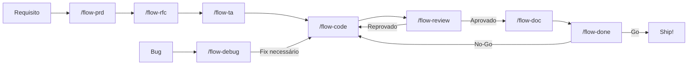

<div align="center">

# AI Dev Flow

### Uma metodologia estruturada para desenvolvimento assistido por IA

**Pare de fazer prompts aleatórios. Comece a engenheirar com IA.**

[](LICENSE)
[](CONTRIBUTING.md)
[](https://github.com/features/copilot)
[](https://cursor.sh)
[](https://claude.ai)

[Começando](#-começando) · [O Fluxo](#-o-fluxo) · [Como Funciona](#-como-funciona) · [Playbook](ai-dev-flow/PLAYBOOK.md) · [English](README.md)

</div>

---

## O Problema

Assistentes de IA para código são poderosos — mas sem estrutura, produzem output inconsistente, não rastreável e difícil de revisar. Times acabam com:

- PRDs sem clareza e sem critérios de aceite
- Decisões de arquitetura feitas no chat e perdidas para sempre
- Código que funciona mas não segue os padrões do projeto
- Reviews que perdem vulnerabilidades de segurança e violações de ADR
- Documentação que fica desatualizada no dia em que é escrita
- Nenhuma definição clara de "pronto"

**AI Dev Flow resolve isso** dando ao seu assistente de IA uma metodologia completa — dos requisitos de produto à prontidão para produção.

---

## O que é o AI Dev Flow?

AI Dev Flow é um **kit de metodologia** que se conecta ao seu projeto existente. Ele oferece:

- **8 slash commands** que guiam a IA por um SDLC estruturado
- **Prompts compartilhados** que funcionam no GitHub Copilot, Cursor e Claude Code
- **Uma base de conhecimento** onde a IA lê guidelines, ADRs e docs de arquitetura do seu projeto
- **Artefatos de trabalho** que criam uma trilha rastreável do PRD à produção
- **Boas práticas de engenharia** embutidas em cada etapa — SOLID, Clean Architecture, DDD, OWASP, TDD

**Não é um framework**, **não é um CLI**, **não é um SaaS**. É um conjunto de arquivos que você copia pro seu projeto. Zero dependências. Zero lock-in.

---

## O Fluxo

```
/flow-prd     → Defina o que construir     (Requisitos de Produto + Definition of Done)
/flow-rfc     → Escolha como construir     (Alternativas, Matriz de Decisão, Recomendação)
/flow-ta      → Projete os detalhes        (Assessment de Engenharia, BDD, Plano de Implementação)
/flow-code    → Construa                   (TDD, Full-cycle: migrations, config, observabilidade)
/flow-review  → Valide                     (Review em 11 dimensões, OWASP 2025, check de DoD)
/flow-doc     → Documente                  (ADRs, Arquitetura C4, Living Documentation)
/flow-done    → Entregue                   (Prontidão para Produção, Retrospectiva, Go/No-Go)
/flow-debug   → Corrija                    (Paralelo — a qualquer momento, investigação sistemática)
```



---

## Começando

### Instalação

```bash
# Clone o repo
git clone https://github.com/YOUR_USERNAME/ai-dev-flow.git /tmp/ai-dev-flow

# Instale no seu projeto (nunca sobrescreve arquivos existentes)
/tmp/ai-dev-flow/setup.sh /path/to/your/project

# Ou em uma linha
git clone https://github.com/YOUR_USERNAME/ai-dev-flow.git /tmp/ai-dev-flow && /tmp/ai-dev-flow/setup.sh .
```

O script copia **42 arquivos** no seu projeto:
- 8 prompts (a metodologia)
- 24 wrappers para assistentes de IA (Copilot + Cursor + Claude Code)
- 5 templates de conhecimento (guidelines, ADRs, arquitetura, PRDs, assessments)
- Referência de princípios de engenharia
- Playbook (manual operacional)
- Diretórios de trabalho para artefatos

**Nunca sobrescreve.** Rode novamente com segurança — só cria o que está faltando.

### Alimente sua Base de Conhecimento (Recomendado)

A IA produz output melhor quando conhece seu projeto. Copie docs existentes:

```
ai-dev-flow/knowledge/
├── guidelines/     ← Seus padrões de código, convenções, patterns
├── adrs/           ← Suas decisões arquiteturais
├── architecture/   ← Seus diagramas e visão do sistema
├── prds/           ← Seus PRDs concluídos
└── assessments/    ← Seus tech assessments concluídos
```

Cada pasta tem um `_template.md` mostrando o formato esperado.

### Comece a Usar

Abra seu assistente de IA e digite:

```
/flow-prd Preciso de uma feature que permita usuários filtrar pedidos por status
```

A IA vai:
1. Ler a base de conhecimento do seu projeto
2. Analisar o requisito criticamente
3. Fazer perguntas de esclarecimento
4. Gerar um PRD estruturado com Definition of Done
5. Sugerir o próximo passo (`/flow-rfc`)

---

## Como Funciona

### Arquitetura

```
seu-projeto/
├── ai-dev-flow/                    ← Tudo vive aqui
│   ├── PLAYBOOK.md                 ← Manual operacional
│   ├── prompts/                    ← Fonte única (8 prompts)
│   ├── knowledge/                  ← O cérebro do seu projeto
│   │   ├── guidelines/             ← Padrões que a IA segue
│   │   ├── adrs/                   ← Decisões que a IA respeita
│   │   ├── architecture/           ← Contexto do sistema que a IA lê
│   │   ├── prds/                   ← PRDs concluídos para referência
│   │   └── assessments/            ← TAs concluídos para referência
│   └── work/                       ← Artefatos gerados pela IA
│       ├── specs/                  ← PRDs, RFCs, TAs ativos
│       └── drafts/                 ← Rascunhos de docs, relatórios de debug
│
├── .github/prompts/                ← Wrappers GitHub Copilot
├── .agent/workflows/               ← Wrappers Cursor
└── .claude/commands/               ← Wrappers Claude Code
```

### Um Prompt, Três Assistentes

Edite uma vez em `ai-dev-flow/prompts/`, todos os assistentes ficam sincronizados:

```
ai-dev-flow/prompts/flow-prd.md      ← Fonte única
        ↓
.github/prompts/flow-prd.prompt.md   → "Leia ai-dev-flow/prompts/flow-prd.md"
.agent/workflows/flow-prd.md         → "Leia ai-dev-flow/prompts/flow-prd.md"
.claude/commands/flow-prd.md         → "Leia ai-dev-flow/prompts/flow-prd.md"
```

---

## O que tem em cada Etapa

| Etapa | Role | Inspirado em | Output Principal |
|-------|------|-------------|-----------------|
| **PRD** | PM Senior | Amazon Working Backwards, MoSCoW | Requisitos, User Stories, DoD |
| **RFC** | Staff Engineer | Google Design Docs, Uber RFCs | Matriz de Decisão, System Design |
| **TA** | Principal Engineer | Checklist de 28 categorias | Cenários BDD, Sequência de Implementação |
| **Code** | Senior Full-Cycle | TDD (Kent Beck), Clean Code, SMURF (Google) | Código, Testes, Migrations, Config |
| **Review** | Staff Reviewer | Google/Microsoft Guidelines, OWASP 2025 | Findings com severidade, validação DoD |
| **Doc** | Arquiteto de Software | Living Documentation (Martraire), C4, ADR (Nygard) | ADRs, Docs de Arquitetura, BDD |
| **Done** | Release Coordinator | Google PRR, Amazon ORR, Microsoft Ship/No-Ship | Relatório de Completude, Retro, Go/No-Go |
| **Debug** | SRE Senior | Agans' 9 Rules, Google SRE, Fishbone | Relatório de Análise, Post-Mortem |

---

## Boas Práticas Embutidas

Cada prompt é baseado em práticas comprovadas de engenharia:

- **Produto**: Amazon Working Backwards, MoSCoW, User & Job Stories
- **Arquitetura**: Clean Architecture, Hexagonal, DDD, SOLID
- **Segurança**: OWASP Top 10:2025 (atualizado com Supply Chain em #3)
- **Qualidade de Código**: Clean Code (Martin), Design Patterns (GoF), Code Smells
- **Testes**: TDD (Beck Canon 2023), SMURF Framework (Google 2024), Test Pyramid
- **Review**: Google Code Review Guidelines, Microsoft Engineering Fundamentals
- **Documentação**: Living Documentation (Martraire), C4 Model (Brown), ADR (Nygard)
- **Incidentes**: Agans' 9 Rules, Google SRE, Amazon COE, Post-Mortems Blameless
- **Conclusão**: Google PRR, Amazon ORR, Microsoft Ship/No-Ship, Wix Feature Retros

---

## Assistentes de IA Suportados

| Assistente | IDE / Ambiente | Slash Commands | Como Funciona |
|-----------|--------------|---------------|--------------|
| **GitHub Copilot** | VS Code, JetBrains, Visual Studio, Xcode, Eclipse | `/flow-prd`, `/flow-rfc`, ... | Lê de `.github/prompts/` |
| **Cursor** | Cursor, JetBrains (via ACP) | `/flow-prd`, `/flow-rfc`, ... | Lê de `.agent/workflows/` |
| **Claude Code** | VS Code, JetBrains, Antigravity, Windsurf, Zed, Neovim, Emacs, Claude Desktop, Terminal | `/flow-prd`, `/flow-rfc`, ... | Lê de `.claude/commands/` |

Todos usam os mesmos prompts. Troque de assistente ou IDE sem mudar nada.

---

## FAQ

<details>
<summary><strong>Preciso seguir todas as 8 etapas pra cada feature?</strong></summary>
<br>
Não. Um bug fix de 3 linhas pode ir direto pra <code>/flow-debug</code> > <code>/flow-code</code> > <code>/flow-review</code>. O ciclo completo é pra features significativas. Escale a cerimônia ao risco.
</details>

<details>
<summary><strong>Funciona com minha stack?</strong></summary>
<br>
Sim. Os prompts são tech-agnostic. Funcionam com qualquer linguagem, framework ou arquitetura. A IA se adapta ao seu projeto lendo <code>knowledge/guidelines/</code>.
</details>

<details>
<summary><strong>E se meu time já tem um processo?</strong></summary>
<br>
AI Dev Flow complementa processos existentes. Você pode adotar etapas individuais (ex: só <code>/flow-review</code> pra melhorar code reviews) sem o ciclo completo.
</details>

<details>
<summary><strong>Posso customizar os prompts?</strong></summary>
<br>
Claro. Os prompts em <code>ai-dev-flow/prompts/</code> são arquivos Markdown. Edite pra atender as necessidades do seu time.
</details>

<details>
<summary><strong>O setup.sh modifica meus arquivos existentes?</strong></summary>
<br>
Nunca. Ele só cria arquivos novos. Se um arquivo já existe, pula.
</details>

---

## Contribuindo

Contribuições são bem-vindas! Seja melhorando prompts, adicionando templates de conhecimento, ou corrigindo documentação.

1. Fork o repo
2. Crie uma branch de feature
3. Faça suas mudanças
4. Abra um PR

---

## Licença

[MIT](LICENSE) — Use, modifique, compartilhe. Grátis pra sempre.

---

<div align="center">

**AI Dev Flow** — Pare de fazer prompts. Comece a engenheirar.

[De uma estrela neste repo](https://github.com/YOUR_USERNAME/ai-dev-flow) se ajudar seu time a entregar software melhor com IA.

</div>
