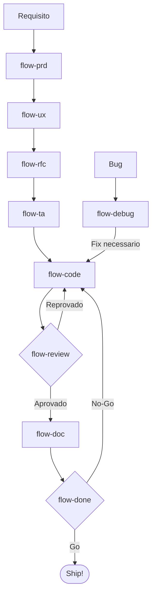
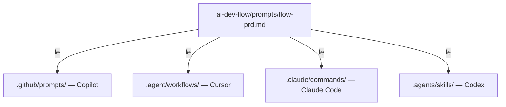
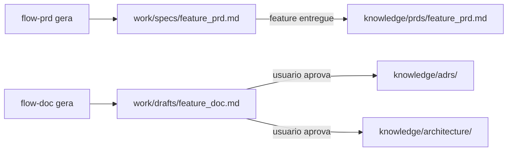

<div align="center">

# AI Dev Flow

### Uma metodologia estruturada para desenvolvimento assistido por IA

**Pare de fazer prompts aleatorios. Comece a engenheirar com IA.**

[](LICENSE)
[](CONTRIBUTING.md)
[](https://github.com/features/copilot)
[](https://cursor.sh)
[](https://claude.ai)
[](https://openai.com/codex)

[Começando](#começando) · [O Fluxo](#o-fluxo) · [Como Funciona](#como-funciona) · [Playbook](ai-dev-flow/PLAYBOOK.md) · [English](README.md)

</div>

---

## O Problema

Assistentes de IA para codigo sao poderosos, mas sem estrutura produzem output inconsistente, nao rastreavel e dificil de revisar. Times acabam com:

- PRDs sem clareza e sem criterios de aceite
- Decisoes de arquitetura feitas no chat e perdidas para sempre
- Codigo que funciona mas nao segue os padroes do projeto
- Reviews que perdem vulnerabilidades de seguranca e violacoes de ADR
- Documentacao que fica desatualizada no dia em que e escrita
- Nenhuma definicao clara de "pronto"

**AI Dev Flow resolve isso** dando ao seu assistente de IA uma metodologia completa, dos requisitos de produto a prontidao para producao.

---

## O que e o AI Dev Flow?

AI Dev Flow e um **kit de metodologia** que se conecta ao seu projeto existente. Ele oferece:

- **9 slash commands** que guiam a IA por um SDLC estruturado
- **Prompts compartilhados** que funcionam no GitHub Copilot, Cursor e Claude Code
- **Uma base de conhecimento** onde a IA le guidelines, ADRs e docs de arquitetura do seu projeto
- **Artefatos de trabalho** que criam uma trilha rastreavel do PRD a producao
- **Boas praticas de engenharia** embutidas em cada etapa (SOLID, Clean Architecture, DDD, OWASP, TDD)

Nao e um framework, nao e um CLI, nao e um SaaS. E um conjunto de arquivos que voce copia pro seu projeto. Zero dependencias. Zero lock-in.

---

## O Fluxo

```
/flow-prd      Defina o que construir      Requisitos de Produto + Definition of Done
/flow-ux       Projete a experiencia       Especificacao UX/UI (Atomic Design, Design Tokens, Motion, WCAG 2.2)
/flow-rfc      Escolha como construir      Alternativas, Matriz de Decisao, Recomendacao
/flow-ta       Projete os detalhes         Assessment de Engenharia, BDD, Plano de Implementacao
/flow-code     Construa                    TDD, Full-cycle: migrations, config, observabilidade
/flow-review   Valide                      Review em 11 dimensoes, OWASP 2025, check de DoD
/flow-doc      Documente                   ADRs, Arquitetura C4, Living Documentation
/flow-done     Entregue                    Prontidao para Producao, Retrospectiva, Go/No-Go
/flow-debug    Corrija                     Paralelo, a qualquer momento, investigacao sistematica
```



---

## Começando

### Instalacao

```bash
# Clone o repo
git clone https://github.com/viniciuscarneiro/ai-dev-flow.git /tmp/ai-dev-flow

# Instale no seu projeto (nunca sobrescreve arquivos existentes)
/tmp/ai-dev-flow/setup.sh /path/to/your/project

# Ou em uma linha
git clone https://github.com/viniciuscarneiro/ai-dev-flow.git /tmp/ai-dev-flow && /tmp/ai-dev-flow/setup.sh .
```

O script copia **56 arquivos** no seu projeto:
- 9 prompts (a metodologia)
- 36 wrappers para assistentes de IA (Copilot + Cursor + Claude Code + Codex)
- 5 templates de conhecimento (guidelines, ADRs, arquitetura, PRDs, assessments)
- Referencia de principios de engenharia e design
- Playbook (manual operacional)
- Diretorios de trabalho para artefatos

**Nunca sobrescreve.** Rode novamente com seguranca, so cria o que esta faltando.

### Alimente sua Base de Conhecimento (Recomendado)

A IA produz output melhor quando conhece seu projeto. Copie docs existentes:

```
ai-dev-flow/knowledge/
├── guidelines/     Seus padroes de codigo, convencoes, patterns
├── adrs/           Suas decisoes arquiteturais
├── architecture/   Seus diagramas e visao do sistema
├── prds/           Seus PRDs concluidos
└── assessments/    Seus tech assessments concluidos
```

Cada pasta tem um `_template.md` mostrando o formato esperado.

### Comece a Usar

Abra seu assistente de IA e digite:

```
/flow-prd Preciso de uma feature que permita usuarios filtrar pedidos por status
```

A IA vai:
1. Ler a base de conhecimento do seu projeto
2. Analisar o requisito criticamente
3. Fazer perguntas de esclarecimento
4. Gerar um PRD estruturado com Definition of Done
5. Sugerir o proximo passo (`/flow-rfc`)

---

## Como Funciona

### Arquitetura

```
seu-projeto/
├── ai-dev-flow/                    Tudo vive aqui
│   ├── PLAYBOOK.md                 Manual operacional
│   ├── prompts/                    Fonte unica (9 prompts)
│   ├── knowledge/                  O cerebro do seu projeto
│   │   ├── guidelines/             Padroes que a IA segue
│   │   ├── adrs/                   Decisoes que a IA respeita
│   │   ├── architecture/           Contexto do sistema que a IA le
│   │   ├── prds/                   PRDs concluidos para referencia
│   │   └── assessments/            TAs concluidos para referencia
│   └── work/                       Artefatos gerados pela IA
│       ├── specs/                  PRDs, RFCs, TAs ativos
│       └── drafts/                 Rascunhos de docs, relatorios de debug
│
├── .github/prompts/                Wrappers GitHub Copilot
├── .agent/workflows/               Wrappers Cursor
├── .claude/commands/               Wrappers Claude Code
└── .agents/skills/                 Wrappers OpenAI Codex
```

### Um Prompt, Quatro Assistentes

Edite uma vez em `ai-dev-flow/prompts/`, todos os assistentes ficam sincronizados:



### Fluxo de Conhecimento

Artefatos tem um ciclo de vida, de trabalho volatil a conhecimento permanente:



---

## O que tem em cada Etapa

| Etapa | Role | Inspirado em | Output Principal |
|-------|------|-------------|-----------------|
| **PRD** | PM Senior | Amazon Working Backwards, MoSCoW | Requisitos, User Stories, DoD |
| **UX** | UX/UI Designer Senior | Atomic Design, Design Tokens, WCAG 2.2 | Design Spec, Component Map, Motion, Acessibilidade |
| **RFC** | Staff Engineer | Google Design Docs, Uber RFCs | Matriz de Decisao, System Design |
| **TA** | Principal Engineer | Checklist de 28 categorias | Cenarios BDD, Sequencia de Implementacao |
| **Code** | Senior Full-Cycle | TDD (Kent Beck), Clean Code, SMURF (Google) | Codigo, Testes, Migrations, Config |
| **Review** | Staff Reviewer | Google/Microsoft Guidelines, OWASP 2025 | Findings com severidade, validacao DoD |
| **Doc** | Arquiteto de Software | Living Documentation (Martraire), C4, ADR (Nygard) | ADRs, Docs de Arquitetura, BDD |
| **Done** | Release Coordinator | Google PRR, Amazon ORR, Microsoft Ship/No-Ship | Relatorio de Completude, Retro, Go/No-Go |
| **Debug** | SRE Senior | Agans' 9 Rules, Google SRE, Fishbone | Relatorio de Analise, Post-Mortem |

---

## Boas Praticas Embutidas

Cada prompt e baseado em praticas comprovadas de engenharia:

- **Produto**: Amazon Working Backwards, MoSCoW, User and Job Stories
- **UX/UI**: Atomic Design (Frost), Design Tokens, Motion Design, WCAG 2.2 AA
- **Arquitetura**: Clean Architecture, Hexagonal, DDD, SOLID, KISS, YAGNI
- **Seguranca**: OWASP Top 10:2025 (atualizado com Supply Chain em #3)
- **Qualidade de Codigo**: Clean Code (Martin), Design Patterns (GoF), Code Smells, KISS, YAGNI
- **Testes**: TDD (Beck Canon 2023), SMURF Framework (Google 2024), Test Pyramid
- **Review**: Google Code Review Guidelines, Microsoft Engineering Fundamentals
- **Documentacao**: Living Documentation (Martraire), C4 Model (Brown), ADR (Nygard)
- **Incidentes**: Agans' 9 Rules, Google SRE, Amazon COE, Post-Mortems Blameless
- **Conclusao**: Google PRR, Amazon ORR, Microsoft Ship/No-Ship, Wix Feature Retros

---

## Assistentes de IA Suportados

| Assistente | IDE / Ambiente | Slash Commands | Como Funciona |
|-----------|--------------|---------------|--------------|
| **GitHub Copilot** | VS Code, JetBrains, Visual Studio, Xcode, Eclipse | `/flow-prd`, `/flow-rfc`, ... | Le de `.github/prompts/` |
| **Cursor** | Cursor, JetBrains (via ACP) | `/flow-prd`, `/flow-rfc`, ... | Le de `.agent/workflows/` |
| **Claude Code** | VS Code, JetBrains, Antigravity, Windsurf, Zed, Neovim, Emacs, Claude Desktop, Terminal | `/flow-prd`, `/flow-rfc`, ... | Le de `.claude/commands/` |
| **OpenAI Codex CLI** | Terminal | `flow-prd`, `flow-rfc`, ... | Le de `.agents/skills/` |

Todos usam os mesmos prompts. Troque de assistente ou IDE sem mudar nada.

---

## FAQ

<details>
<summary><strong>Preciso seguir todas as 9 etapas pra cada feature?</strong></summary>
<br>
Nao. Um bug fix de 3 linhas pode ir direto pra <code>/flow-debug</code> > <code>/flow-code</code> > <code>/flow-review</code>. O ciclo completo e pra features significativas. Escale a cerimonia ao risco.
</details>

<details>
<summary><strong>Funciona com minha stack?</strong></summary>
<br>
Sim. Os prompts sao tech-agnostic. Funcionam com qualquer linguagem, framework ou arquitetura. A IA se adapta ao seu projeto lendo <code>knowledge/guidelines/</code>.
</details>

<details>
<summary><strong>E se meu time ja tem um processo?</strong></summary>
<br>
AI Dev Flow complementa processos existentes. Voce pode adotar etapas individuais (ex: so <code>/flow-review</code> pra melhorar code reviews) sem o ciclo completo.
</details>

<details>
<summary><strong>Posso customizar os prompts?</strong></summary>
<br>
Claro. Os prompts em <code>ai-dev-flow/prompts/</code> sao arquivos Markdown. Edite pra atender as necessidades do seu time.
</details>

<details>
<summary><strong>O setup.sh modifica meus arquivos existentes?</strong></summary>
<br>
Nunca. Ele so cria arquivos novos. Se um arquivo ja existe, pula.
</details>

---

## Contribuindo

Contribuicoes sao bem-vindas! Seja melhorando prompts, adicionando templates de conhecimento, ou corrigindo documentacao.

1. Fork o repo
2. Crie uma branch de feature
3. Faca suas mudancas
4. Abra um PR

---

## Licenca

[MIT](LICENSE)

---

<div align="center">

**AI Dev Flow**

Pare de fazer prompts. Comece a engenheirar.

[De uma estrela neste repo](https://github.com/viniciuscarneiro/ai-dev-flow) se ajudar seu time a entregar software melhor com IA.

</div>
