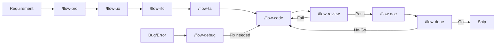

# AI Dev Flow — Playbook

This is the operating manual for AI-assisted development using the AI Dev Flow methodology. It defines the workflow, directory structure, and rules that AI coding assistants must follow.

---

## The Flow

Feature development follows a 9-step cycle. Each step has a dedicated slash command and produces traceable artifacts.

```
/flow-prd     → What the user needs (Product Requirements + Definition of Done)
/flow-ux      → How the user experiences it (UX/UI Design Specification)
/flow-rfc     → Which technical approach (Alternatives, Decision Matrix, Recommendation)
/flow-ta      → How to build it (Detailed engineering design, BDD, Implementation sequence)
/flow-code    → Build it (TDD, Full-cycle implementation)
/flow-review  → Validate it (Multi-dimensional code review)
/flow-doc     → Document it (ADRs, Architecture, Living Documentation)
/flow-done    → Ship it (DoD validation, Production Readiness, Retrospective)
/flow-debug   → Fix it (Parallel — can be triggered at any time)
```



### Step 1: PRD — `/flow-prd`

| | |
|---|---|
| **Purpose** | Define what the user needs from a product perspective |
| **Role** | Senior Product Manager (Working Backwards, MoSCoW, Critical Analysis) |
| **Input** | Business need, user complaint, stakeholder request, or existing PRD to refine |
| **Output** | `ai-dev-flow/work/specs/[FEATURE]_prd.md` |
| **Key artifacts** | Problem Statement, User Stories, Job Stories, Functional Requirements (MoSCoW), Success Metrics, Definition of Done |
| **References** | Amazon Working Backwards, Google PRD practices |

### Step 2: UX — `/flow-ux`

| | |
|---|---|
| **Purpose** | Define how the user experiences the product |
| **Role** | Senior UX/UI Designer & Design System Architect |
| **Input** | Approved PRD, user flow description, or redesign request |
| **Output** | `ai-dev-flow/work/specs/[FEATURE]_ux.md` |
| **Key artifacts** | Design Principles, User Personas & JTBD, Information Architecture, User Flows, Design Tokens, Component Inventory (Atomic Design), Layout Specs, Motion & Animation, Accessibility (WCAG 2.2), Visual References |
| **References** | Double Diamond, Design Thinking (IDEO), Atomic Design (Brad Frost), Material Design 3, Apple HIG, WCAG 2.2, Awwwards, Godly |
| **Skip when** | Feature has no user-facing interface: APIs, background jobs, infrastructure, CLI tools, libraries |

### Step 3: RFC — `/flow-rfc`

| | |
|---|---|
| **Purpose** | Evaluate technical approaches and recommend one |
| **Role** | Staff Engineer / System Designer |
| **Input** | Approved PRD |
| **Output** | `ai-dev-flow/work/specs/[FEATURE]_rfc.md` |
| **Key artifacts** | 2-4 proposed solutions, System Design Dimensions, Decision Matrix, Recommendation with trade-offs |
| **References** | Google Design Docs, Uber RFC process |

### Step 4: Tech Assessment — `/flow-ta`

| | |
|---|---|
| **Purpose** | Deep-dive engineering design for the chosen solution |
| **Role** | Principal Engineer |
| **Input** | Approved RFC |
| **Output** | `ai-dev-flow/work/specs/[FEATURE]_ta.md` |
| **Key artifacts** | 28-category Engineering Reference checklist, BDD scenarios (Gherkin), Implementation Sequence with task dependencies |
| **References** | SOLID, Clean Architecture, DDD, OWASP, GoF Patterns |

### Step 5: Code — `/flow-code`

| | |
|---|---|
| **Purpose** | Implement the feature following the TA |
| **Role** | Senior Full-Cycle Software Engineer |
| **Input** | Approved TA (BDD scenarios + implementation sequence) |
| **Output** | Code, tests, migrations, configuration, wiring |
| **Key artifacts** | TDD cycle (Red→Green→Refactor), Full-cycle delivery (migrations, env vars, feature flags, observability) |
| **References** | TDD (Kent Beck 2023), Clean Code (Robert C. Martin), SMURF (Google 2024) |

### Step 6: Review — `/flow-review`

| | |
|---|---|
| **Purpose** | Multi-dimensional code review |
| **Role** | Staff Engineer / Code Review Specialist |
| **Input** | Code diff + TA/RFC reference |
| **Output** | Structured review report with findings, severity, and verdict |
| **Key artifacts** | 11 review dimensions, OWASP 2025, DoD validation, Severity classification (Blocker/Major/Minor/Praise) |
| **References** | Google Code Review Guidelines, Microsoft Engineering Fundamentals, OWASP Top 10:2025 |

### Step 7: Documentation — `/flow-doc`

| | |
|---|---|
| **Purpose** | Document what was built or reverse-engineer existing code |
| **Role** | Software Architect / Technical Writer |
| **Input** | Implemented code + TA/RFC trail |
| **Output** | `ai-dev-flow/work/drafts/` → promoted to `ai-dev-flow/knowledge/` with user approval |
| **Key artifacts** | ADRs (Nygard format), C4 Architecture diagrams (Mermaid), BDD from code, Health Assessment (reverse mode) |
| **References** | Living Documentation (Cyrille Martraire), C4 Model (Simon Brown), Docs as Code |

### Step 8: Done — `/flow-done`

| | |
|---|---|
| **Purpose** | Feature completion ceremony — validate DoD, production readiness, retrospective |
| **Role** | Release Coordinator / Quality Gate Specialist |
| **Input** | All artifacts from the flow |
| **Output** | `ai-dev-flow/work/specs/[FEATURE]_done.md` |
| **Key artifacts** | DoD validation with evidence, Production Readiness Checklist, Feature Retrospective, Go/No-Go Verdict |
| **References** | Google SRE PRR, Amazon ORR, Microsoft Ship/No-Ship, Wix Feature Retrospectives |

### Step 9: Debug — `/flow-debug` (Parallel)

| | |
|---|---|
| **Purpose** | Investigate bugs, errors, and unexpected behavior |
| **Role** | Senior SRE / Debugging Specialist |
| **Input** | Error message, stack trace, unexpected behavior, or production incident |
| **Output** | `ai-dev-flow/work/drafts/analysis/[CONTEXT]_analysis.md` (+ post-mortem for P1/P2) |
| **Key artifacts** | Triage, Common Causes Checklist, 5 Whys, Fishbone/Ishikawa, Rollback Decision, Blameless Post-Mortem |
| **References** | David Agans' 9 Rules of Debugging, Google SRE Incident Management, Amazon COE |

---

## Directory Structure

```
ai-dev-flow/
├── PLAYBOOK.md                          # <- You are here
│
├── prompts/                             # [Source of Truth] The 9 AI prompts
│   ├── flow-prd.md                      # Product Requirements
│   ├── flow-ux.md                       # UX/UI Design Specification
│   ├── flow-rfc.md                      # Request for Comments
│   ├── flow-ta.md                       # Tech Assessment
│   ├── flow-code.md                     # Implementation
│   ├── flow-review.md                   # Code Review
│   ├── flow-doc.md                      # Documentation
│   ├── flow-done.md                     # Feature Completion
│   └── flow-debug.md                    # Debugging
│
├── knowledge/                           # [Permanent] Project knowledge base
│   ├── guidelines/                      # Code standards, conventions, patterns
│   │   ├── engineering-principles.md    # Shared engineering reference (SOLID, Clean Code, DDD, etc.)
│   │   ├── design-principles.md         # Shared design reference (Atomic Design, Tokens, Motion, A11y)
│   │   └── _template.md                # Template for creating new guidelines
│   ├── adrs/                            # Architectural Decision Records
│   │   └── _template.md                # ADR template (Nygard format)
│   ├── architecture/                    # System diagrams and overview (C4 Model)
│   │   └── _template.md                # Architecture template
│   ├── prds/                            # Completed PRDs (promoted from work/specs/)
│   │   └── _template.md                # PRD template
│   └── assessments/                     # Completed TAs (promoted from work/specs/)
│       └── _template.md                # TA template
│
└── work/                                # [Volatile] AI-generated work artifacts
    ├── specs/                           # Active PRDs, RFCs, TAs, Done reports
    └── drafts/                          # Documentation drafts and analyses
        └── analysis/                    # Debug investigation reports
```

### AI Coding Assistant Wrappers

Each assistant reads from its own location, all pointing to `ai-dev-flow/prompts/`:

```
.github/prompts/flow-*.prompt.md  → GitHub Copilot
.agent/workflows/flow-*.md        → Cursor
.claude/commands/flow-*.md        → Claude Code
.agents/skills/flow-*/SKILL.md    → OpenAI Codex
```

Edit once in `ai-dev-flow/prompts/`, all four assistants stay in sync.

### Convention: `_template.md`

Files starting with `_` are templates for the user. They show the expected format for each knowledge type. AI prompts ignore `_template.md` files — they only read real artifacts.

---

## Knowledge Flow

Artifacts have a lifecycle: they start as volatile work, get reviewed, and are promoted to permanent knowledge.

```
/flow-prd generates → work/specs/feature_prd.md
                          ↓ (feature delivered + /flow-done approved)
                      knowledge/prds/feature_prd.md

/flow-ux generates  → work/specs/feature_ux.md
                          ↓ (design tokens and patterns mature into reusable guidelines)
                      knowledge/guidelines/design-principles.md (updated)

/flow-ta generates  → work/specs/feature_ta.md
                          ↓ (feature delivered + /flow-done approved)
                      knowledge/assessments/feature_ta.md

/flow-doc generates → work/drafts/feature_doc.md
                          ↓ (user approves promotion)
                      knowledge/adrs/NNN-decision.md
                      knowledge/architecture/module.md
```

**Rule:** Promotion from `work/` to `knowledge/` always requires explicit user approval. The AI never moves artifacts automatically.

---

## Rules for AI Coding Assistants

1. **Context is King.** Before responding, read relevant files from `ai-dev-flow/knowledge/` and active `ai-dev-flow/work/` artifacts.

2. **Don't Guess.** If information is missing, ask the user. Assumptions are dangerous.

3. **Traceability.** Always cite which `ai-dev-flow/work/` file you are using as reference.

4. **Respect ADRs.** Decisions in `ai-dev-flow/knowledge/adrs/` are authoritative. To propose a change, justify it and create a new ADR.

5. **Follow Guidelines.** Code standards, naming conventions, and architecture patterns are defined in `ai-dev-flow/knowledge/guidelines/`. The shared `engineering-principles.md` is the baseline for all engineering decisions. The shared `design-principles.md` is the baseline for all design decisions.

6. **Follow the Project's Patterns.** Read the existing codebase before writing new code. Consistency with the project matters more than personal preference.

7. **Prompt Immutability.** Never alter files in `ai-dev-flow/prompts/` unless explicitly asked to update instructions.

8. **Single Source of Truth.** `ai-dev-flow/knowledge/` is official documentation. `ai-dev-flow/work/` contains volatile work artifacts that may be promoted to knowledge after approval.

9. **User Approval Required.** Every step transition requires explicit user approval. The AI suggests the next step but never proceeds without confirmation.

10. **Templates are Ignored.** Files starting with `_` are templates for the user. AI prompts should not read them as real artifacts.

---

## Best Practices

- **Don't skip steps — except `/flow-ux` when there is no UI.** For new features with screens, follow the full cycle. For backend-only work (APIs, jobs, infrastructure, libraries), skip `/flow-ux` and go straight from `/flow-prd` to `/flow-rfc`. For simple bugs, go straight to `/flow-debug` → `/flow-code` → `/flow-review`.
- **Seed your knowledge base.** Before starting, populate `ai-dev-flow/knowledge/` with existing guidelines, ADRs, and architecture docs. The richer the knowledge base, the better the AI's output.
- **Living Guidelines.** Keep `ai-dev-flow/knowledge/guidelines/` updated as your project evolves. New patterns, new conventions, new ADRs — capture them.
- **Cleanup.** Periodically archive old work from `ai-dev-flow/work/`. Promote completed artifacts to `knowledge/`.
- **Versioned Prompts.** Changes to AI behavior should be made in `ai-dev-flow/prompts/`. Discuss with the team and open a PR.
- **Scale the ceremony.** A 3-line bug fix doesn't need `/flow-prd` → `/flow-rfc` → `/flow-ta`. Use judgment — the flow is a tool, not a bureaucracy.
