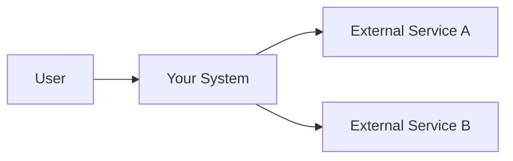
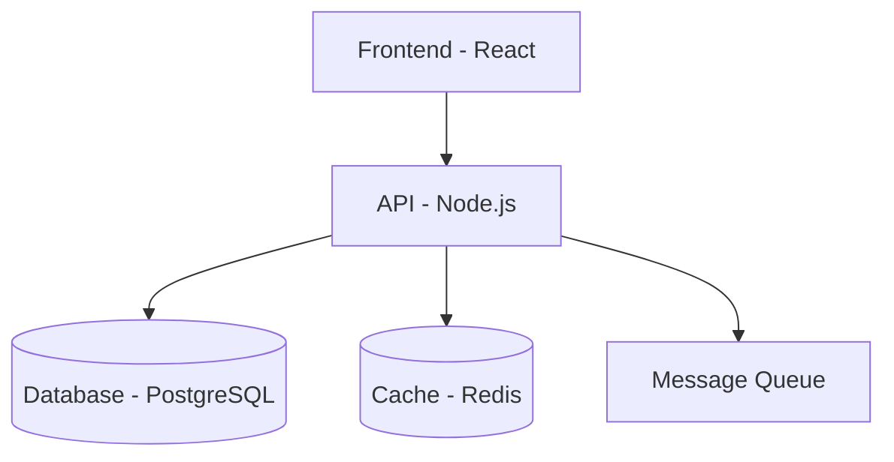
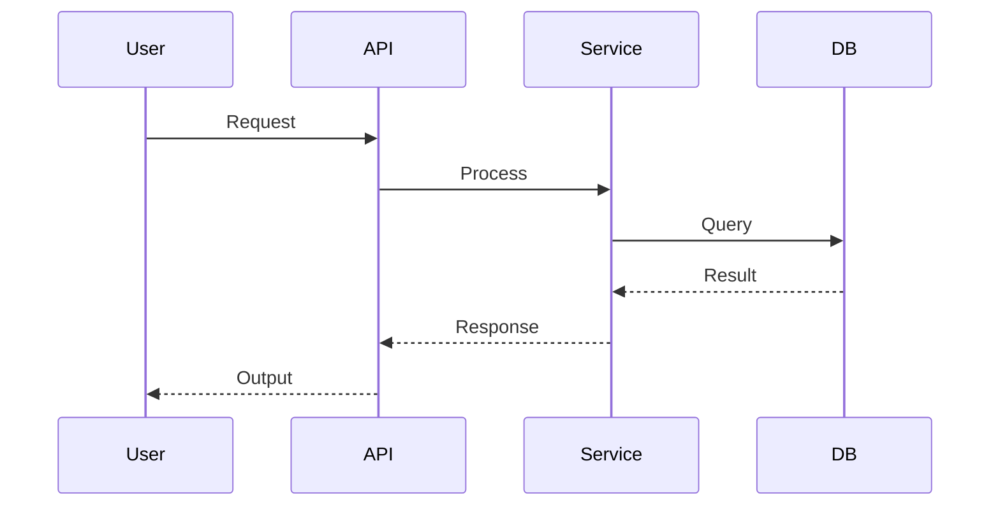

# Architecture: [System/Module Name]

> This is a template following the C4 Model (Simon Brown).
> Copy this file, rename it, and fill in. Use Mermaid for diagrams.
> Files starting with `_` are ignored by AI Dev Flow prompts.

## Overview

1-2 paragraphs describing the system/module, its purpose, and its role in the larger system.

## Context (C4 Level 1)

How does this system interact with users and external systems?

## Containers (C4 Level 2)

What are the main deployable units? (APIs, databases, queues, frontends)

## Components (C4 Level 3)

What are the main components inside a container? (Use only for complex modules)

| Component | Responsibility | Location |
|-----------|---------------|----------|
| [name] | [what it does] | `path/to/` |

## Key Decisions

- References ADR-[NNN]: [relevant architectural decision]

## Data Flow

Describe or diagram how data moves through the system for the main use case.

